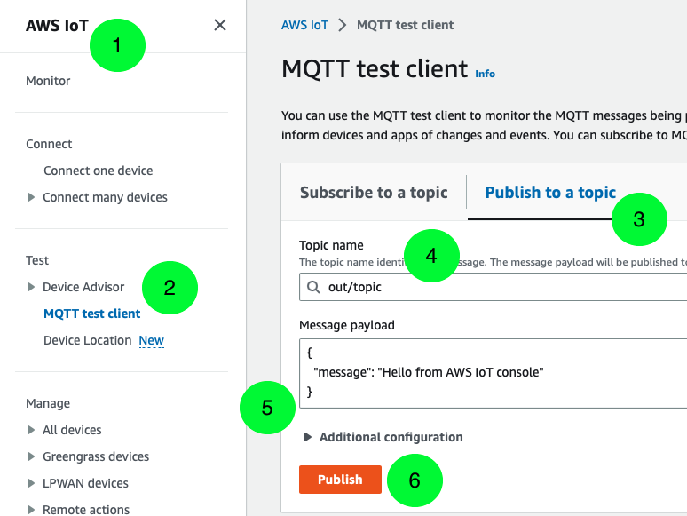

# CDK Stack for Processing and Querying Edge ML Outputs
This project demonstrates the automatic creation of AWS CloudFormation Stack using AWS CDK for querying and processing the MQTT Messages coming from IoT Edge Devices. The project assumes MQTT messages are being sent from the Edge device to AWS IoT Core. The AWS CDK creates a IoT Rule to route the MQTT Messages to a Amazon SNS topic which in turn uses a SQS queue to load the messages. The Amazon SQS queue is then used to trigger an AWS Lambda function which would send a Amazon SNS Email Notification and also upload the payload as a JSON to Amazon S3 bucket. The stack also creates AWS Glue Crawlers and AWS Glue Databases which would query for data in the Amazon S3 bucket and use them to load into Amazon Athena for any downline uses. 

## AWS Architecture
The AWS Architecture used for this project is as follows:


Data Flow:
```
MQTT -> IoT Core Rule -> SNS -> SQS -> Lambda -> S3 + SNS -> Glue/Athena
```

## Getting Started
- Install NPM and use it to install CDK:
```
$ [Ubuntu] sudo apt install nodejs npm
  [MacOS ] brew install node
$ npm install -g aws-cdk
```
- For CDK Setup to create S3, Glue DB, Glue Tables, Glue Crawlers and SNS Topics, use following steps:
```
$ cd mqtt-s3-glue-sns
$ python3 -m venv .venv
$ source .venv/bin/activate
$ pip3 install -r requirements.txt
$ cdk synth
$ cdk bootstrap
$ cdk deploy --parameters targetEmail={EmailForSNSNotifications}@{Domain}.com
```

## Testing
Once the CDK Stack is successfully built, it can be tested by publishing a MQTT Message to topic `out/topic` using the following steps:
1. From *AWS Console*, go to *AWS IoT*
2. Select *MQTT test client* from the left panel
3. Select *Publish to a topic* option
4. Add the *Topic name* as: `out/topic`
5. Write any *Message payload* that needs to be sent
6. Click on *Publish* to publish the MQTT Message


---
## Contributors
- [Romil Shah (@rpshah)](rpshah@amazon.com)
- [Theodore Bakanas (@bakanat)](bakanat@amazon.com)
