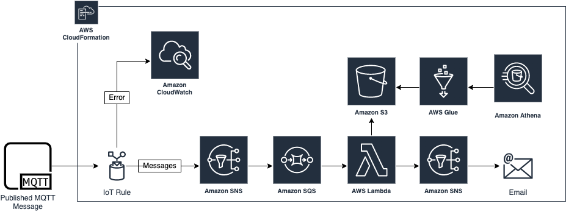

# IoT Rules + SNS + SQS + Lambda + S3
This Python implementation creates 1 S3 Bucket, 1 Glue Databases, 1 Glue Crawlers for the S3 Bucket and 1 SNS Topic for Email Notifications.
The CDK AWS Architecture is as follows:


The `cdk.json` file tells the CDK Toolkit how to execute your app.

This project is set up like a standard Python project.  The initialization process also creates a virtualenv within this project, stored under the `.venv` directory.  To create the virtualenv it assumes that there is a `python3` (or `python` for Windows) executable in your path with access to the `venv` package. If for any reason the automatic creation of the virtualenv fails, you can create the virtualenv manually.

- For CDK Setup to create S3, Glue DB, Glue Tables, Glue Crawlers and SNS Topics, use following steps:
```
$ [ONLY FIRST TIME] python3 -m venv .venv
$ source .venv/bin/activate
$ pip3 install -r requirements.txt
$ cdk synth
$ cdk bootstrap
$ cdk deploy --parameters targetEmail={YOUR EMAIL FOR SNS}@{DOMAIN}.com
```